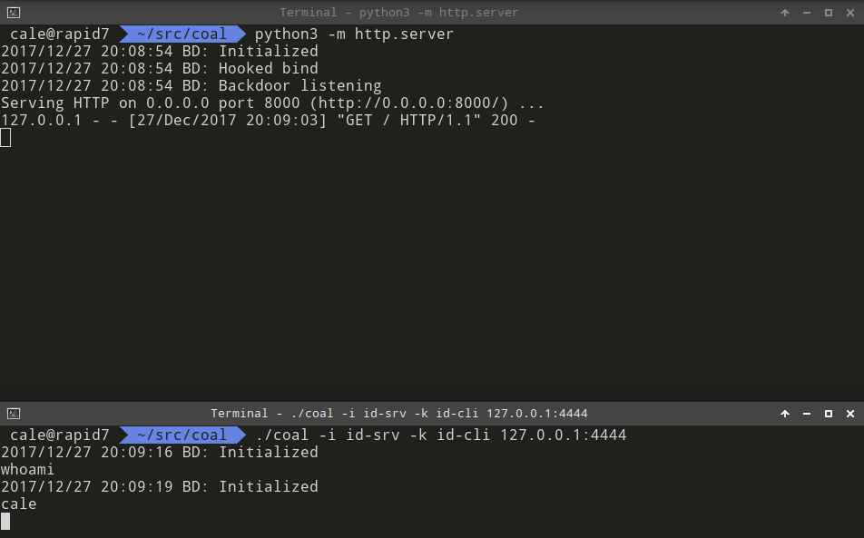

# coalkit
Coalkit is an attempt at a Proof-of-Concept for a penetration testing oriented userspace ld.so rootkit by hooking bind() and eventually accept() system calls. See the relevent blog post (link pending). Initially written in Go, but that is subject to change anytime, mostly because [this issue](https://github.com/golang/go/issues/16843) causes prevention of boot time loading of the Go library in `ld.so.preload`.

## NOTES
WARNING!!!: Do not use this except for learning, it is extremely unstable, untested, and incomplete. This should be considered a "tech preview" for the longer term project, it contains very little of the big *wanted* features.

## Building
* Edit `config.mk` to match the expected configuration
* Compile and generate keypairs: `make`
* Run the victim process with the shared object being loaded: `LD_PRELOAD=./coalkit python3 -m http.server`
* The process should run as normal and a new bind shell running the mutually authenticated keys with the [NoiseSocket](https://noiseprotocol.org/specs/noisesocket.html) protocol backing it. Access it with the client shell program: `./coal -i id-srv -k id-cli 127.0.0.1:4444`

An example of a fully hooked process with debugging enabled can be seen below:

